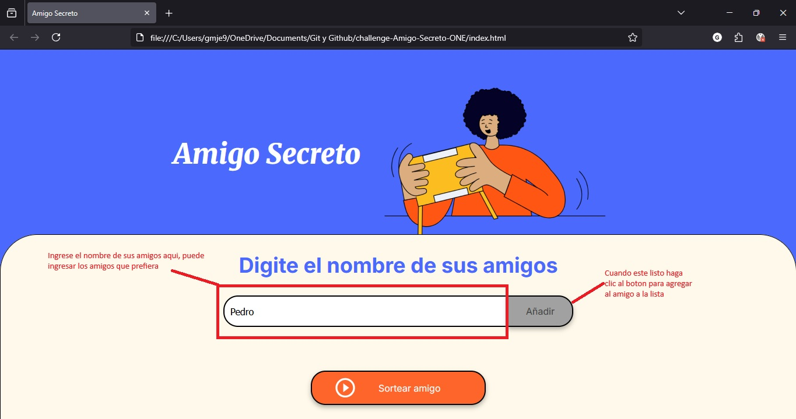
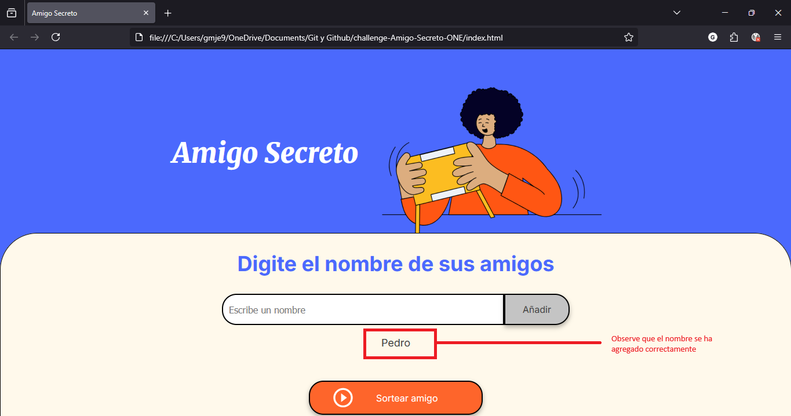
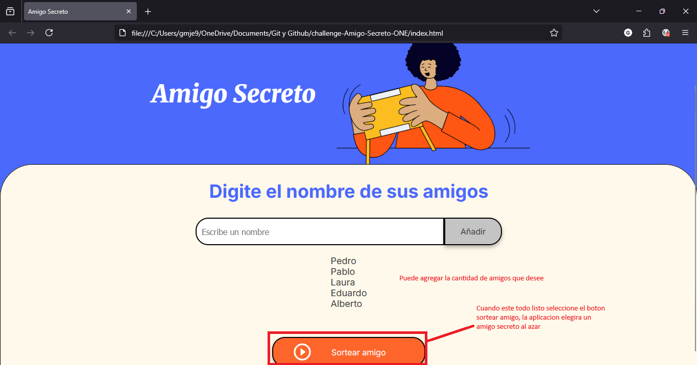
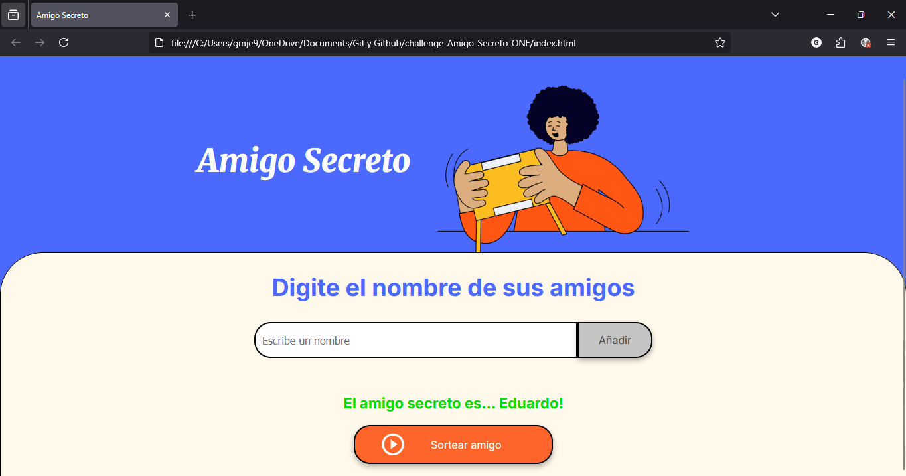

# Juego del Amigo Secreto!

# Descripción
Esta es una aplicación web básica que implementa el challenge de Alura de "Amigo Secreto". Permite a los usuarios ingresar varios nombres que se irán agregando a una lista que se muestra en pantalla, y luego realizar un sorteo aleatorio para seleccionar al amigo secreto.

# Características principales
  * Interfaz sencilla e intuitiva
  * Capacidad para agregar múltiples nombres a una lista
  * Función de sorteo aleatorio
  * Visualización clara del resultado

# Tecnologías utilizadas
  * HTML5
  * CSS3
  * JavaScript (Vanilla)

# Cómo usar
  1. Ingresa los nombres de los participantes en el campo de texto
     
  2. Haz clic en "Añadir" para añadir cada nombre a la lista
     
  3. Cuando hayas agregado todos los nombres, haz clic en "Sortear amigo secreto"
     
  4. ¡El sistema seleccionará aleatoriamente y mostrará el amigo secreto!
     

# Instalación
No se requiere instalación. Simplemente descarga los archivos desde el repositorio y abre el archivo index.html en tu navegador web favorito.
  1. `git clone https://github.com/EduardoGijon/challenge-Amigo-Secreto-ONE`
  2. `cd challenge-Amigo-Secreto-ONE/`
